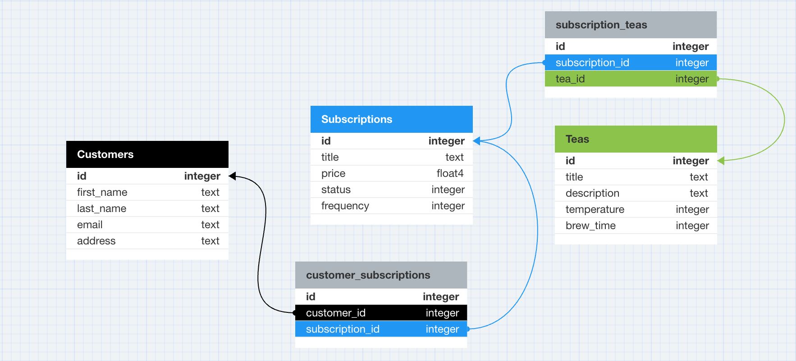

<a name="readme-top"></a>

[![Contributors][contributors-shield]][contributors-url]
[![Forks][forks-shield]][forks-url]
[![Stargazers][stars-shield]][stars-url]
[![Issues][issues-shield]][issues-url]
[![MIT License][license-shield]][license-url]

<!-- PROJECT LOGO -->
<div align="center">
  <a href="https://github.com/garrettgregor/teahouse-api">
    
  </a>

<h2 align="center">Teahouse</h2>

  <p align="center">
    An api for customers to subscribe to a teahouse subscription!
    <br>
    <!--<a href="https://github.com/garrettgregor/teahouse-api"><strong>Explore the docs »</strong></a>-->
    <!--<br>-->
    <!--<a href="https://github.com/garrettgregor/teahouse-api">View Demo</a>-->
    <!--.-->
    <a href="https://github.com/garrettgregor/teahouse-api/issues">Report Bug</a>
    ·
    <a href="https://github.com/garrettgregor/teahouse-api/issues">Request Feature</a>
  </p>
</div>

<!-- TABLE OF CONTENTS -->
<details>
  <summary>Table of Contents</summary>
  <ol>
    <li>
      <a href="#about-the-project">About The Project</a>
      <ul>
        <li><a href="#built-with">Built With</a></li>
      </ul>
    </li>
    <li>
      <a href="#getting-started">Getting Started</a>
      <ul>
        <li><a href="#prerequisites">Prerequisites</a></li>
        <li><a href="#installation">Installation</a></li>
      </ul>
    </li>
    <li><a href="#usage">Usage</a></li>
      <ul>
        <li><a href="#endpoints">Endpoints</a></li>
      </ul>
    <li><a href="#roadmap">Roadmap</a></li>
    <li><a href="#contributing">Contributing</a></li>
    <li><a href="#license">License</a></li>
    <li><a href="#contact">Contact</a></li>
    <li><a href="#acknowledgments">Acknowledgments</a></li>
  </ol>
</details>

<!-- ABOUT THE PROJECT -->
## About The Project

A take home challenge Rails API designed with three endpoints. Allows users to update subscriptions, create new subscriptions, and see which subscriptions they have regardless of status.<br>[Project Spec/Requirements](https://mod4.turing.edu/projects/take_home/take_home_be)

<div align="center">
  <a href="https://github.com/garrettgregor/teahouse-api">
    
  </a>
</div>

<p align="right">(<a href="#readme-top">back to top</a>)</p>

### Built With


[](https://github.com/rubocop/rubocop)
[](https://rubystyle.guide)
[Readme Template](https://github.com/othneildrew/Best-README-Template)

<p align="right">(<a href="#readme-top">back to top</a>)</p>

<!-- GETTING STARTED -->
## Getting Started

Ensure you have the following installed prior to installing the Teahouse API:

### Prerequisites

- Ruby 3.2.2
- Rails 7.0.8
- Postgresql 14

### Installation

Follow these steps to install the Teahouse API:

<details close>

1. Fork or clone a copy of this repo, then run the following commands from the project directory in your terminal:

    ```zsh
    git clone https://github.com/garrettgregor/teahouse-api.git
    ```

1. Navigate to the project directory:

    ```zsh
    cd teahouse-api
    ```

1. Install the required gems:

    ```zsh
    bundle install
    ```

1. Run migrations:

    ```zsh
    rails db:{drop,create,migrate,seed}
    ```

1. Run test suite to ensure functionality is working.

    ```zsh
    bundle exec rspec
    ```

1. Start the development server:

    ```zsh
    rails s
    ```

    1. The server should start running at <http://127.0.0.1:3000/>

</details>
<p align="right">(<a href="#readme-top">back to top</a>)</p>

<!-- USAGE EXAMPLES -->
## Usage

### Endpoints

<details close>

### Show Customer and their Subscriptions

<details close>

```http
GET /api/v1/customers/:id/
```

#### Parameters

```
:id => customer_id
```

| Code | Description |
| :--- | :---------- |
| 200  | `OK`        |

#### Example Response

```json
{
    "data": {
        "type": "customer",
        "id": 1,
        "attributes": {
            "first_name": "Tea",
            "last_name": "Tree",
            "email": "tea@teatree.com",
            "address": "123 Main St, New York, NY 10101"
        },
        "subscriptions": [
            {
                "id": 1,
                "title": "Premium",
                "status": "inactive",
                "price": 5.99,
                "frequency": "yearly",
                "tea_id": 1,
                "tea_name": "Bael Fruit",
                "tea_description": "Quae accusamus quia laudantium.",
                "tea_temperature": 212,
                "tea_brew_time": 242
            },
            {
                "id": 2,
                "title": "Premium",
                "status": "active",
                "price": 5.99,
                "frequency": "monthly",
                "tea_id": 2,
                "tea_name": "Kapor",
                "tea_description": "Culpa tenetur nihil ipsum.",
                "tea_temperature": 175,
                "tea_brew_time": 299
            }
        ]
    }
}
```

##### Error Response

| Code | Description |
| :--- | :---------- |
| 404  | `NOT FOUND` |

```json
{
    "errors": [
        {
            "status": "404",
            "title": "Couldn't find Customer with 'id'=2"
        }
    ]
}
```

</details>

### Create a new Subscription

<details close>

```http
POST /api/v1/customers/:id/subscriptions
```

#### Parameters

```
:id => customer_id
```

| Code | Description |
| :--- | :---------- |
| 200  | `OK`  |

#### Request Body

```json
{
  "tea_id": 1,
  "title": "Student Subscription",
  "price": 5.99,
  "status": 1,
  "frequency": 0
}
```

#### Example Response

```json
{
  "data": {
    "id": "4",
    "type": "subscription",
    "attributes": {
      "title": "Student Subscription",
      "price": 5.99,
      "status": "active",
      "frequency": "daily"
    },
    "relationships": {
      "tea": {
        "data": {
            "id": "1",
            "type": "tea"
        }
      },
      "customer": {
        "data": {
            "id": "1",
            "type": "customer"
        }
      }
    }
  }
}
```

##### Error Response

| Code | Description |
| :--- | :---------- |
| 406  | `NOT ACCEPTABLE` |

```json
{
  "error": "Cannot create this subscription"
}
```

</details>

### Update Subscription Status for a Customer

<details close>

```http
PATCH /api/v1/customers/:customer_id/subscriptions/:subscription_id
```

#### Parameters

```
:customer_id => customer_id
:subscription_id => subscription_id
```

| Code | Description |
| :--- | :---------- |
| 200  | `OK`  |

#### Request Body

```json
{
  "subscription":
    {
      "status": 0
    }
}
```

#### Example Response

```json
{
  "data": {
    "id": "3",
    "type": "subscription",
    "attributes": {
      "title": "Student Subscription",
      "price": 5.99,
      "status": "inactive",
      "frequency": "daily"
    },
    "relationships": {
      "tea": {
        "data": {
          "id": "1",
          "type": "tea"
        }
      },
      "customer": {
        "data": {
          "id": "1",
          "type": "customer"
        }
      }
    }
  }
}
```

Error Response:

| Code | Description |
| :--- | :---------- |
| 406  | `NOT ACCEPTABLE` |

```json
{
  "error": "Cannot update this subscription"
}
```

</details>

</details>
</details>
</details>

<p align="right">(<a href="#readme-top">back to top</a>)</p>

<!-- ROADMAP -->
## Roadmap

- [ ] Add full CRUD functionality for customers
- [ ] Add full CRUD functionality for subscriptions
- [ ] Add full CRUD functionality for teas
- [ ] Consume Spoontacular API for additional tea info

See the [open issues](https://github.com/garrettgregor/teahouse-api/issues) for a full list of proposed features (and known issues).

<p align="right">(<a href="#readme-top">back to top</a>)</p>

<!-- CONTRIBUTING -->
## Contributing

Contributions are what make the open source community such an amazing place to learn, inspire, and create. Any contributions you make are **greatly appreciated**.

If you have a suggestion that would make this better, please fork the repo and create a pull request. You can also simply open an issue with the tag "enhancement".
Don't forget to give the project a star! Thanks again!

1. Fork the Project
1. Follow Installation Instructions
1. Create your Feature Branch (`git checkout -b feature/AmazingFeature`)
1. Commit your Changes (`git commit -m 'Add some AmazingFeature'`)
1. Push to the Branch (`git push origin feature/AmazingFeature`)
1. Open a Pull Request

<p align="right">(<a href="#readme-top">back to top</a>)</p>

<!-- LICENSE -->
## License

Distributed under the MIT License. See `LICENSE.txt` for more information.

<p align="right">(<a href="#readme-top">back to top</a>)</p>

<!-- CONTACT -->
## Contact

Garrett Gregor [![LinkedIn][linkedin-shield]][linkedin-url-gg] [![GitHub][github-shield]][github-url-gg]

Project Link: [https://github.com/garrettgregor/teahouse-api](https://github.com/garrettgregor/teahouse-api)

<p align="right">(<a href="#readme-top">back to top</a>)</p>

<!-- ACKNOWLEDGMENTS -->
## Acknowledgments

My amazing instructors:

- [Erin Pintozzi](https://github.com/epintozzi)
- [Brian Zanti](https://github.com/BrianZanti)

<p align="right">(<a href="#readme-top">back to top</a>)</p>

<!-- MARKDOWN LINKS & IMAGES -->
<!-- https://www.markdownguide.org/basic-syntax/#reference-style-links -->
[contributors-shield]: https://img.shields.io/github/contributors/garrettgregor/teahouse-api.svg?style=for-the-badge
[contributors-url]: https://github.com/garrettgregor/teahouse-api/graphs/contributors
[forks-shield]: https://img.shields.io/github/forks/garrettgregor/teahouse-api.svg?style=for-the-badge
[forks-url]: https://github.com/garrettgregor/teahouse-api/network/members
[stars-shield]: https://img.shields.io/github/stars/garrettgregor/teahouse-api.svg?style=for-the-badge
[stars-url]: https://github.com/garrettgregor/teahouse-api/stargazers
[issues-shield]: https://img.shields.io/github/issues/garrettgregor/teahouse-api.svg?style=for-the-badge
[issues-url]: https://github.com/garrettgregor/teahouse-api/issues
[license-shield]: https://img.shields.io/github/license/garrettgregor/teahouse-api.svg?style=for-the-badge
[license-url]: https://github.com/garrettgregor/teahouse-api/blob/master/LICENSE.txt
[github-shield]: https://img.shields.io/badge/GitHub-100000?style=for-the-badge&logo=github&logoColor=white
[github-url-gg]: https://github.com/garrettgregor
[linkedin-shield]: https://img.shields.io/badge/-LinkedIn-black.svg?style=for-the-badge&logo=linkedin&colorB=555
[linkedin-url-gg]: https://linkedin.com/in/garrett-gregor
